<div align="center">

# GDKP

### Goal-Driven Knowledge Products for Codex

Turn a learning, research, or product goal into an evidence-backed publication, a reusable knowledge view, and a verified outcome.

[](#version-and-integrity)
[](#core-skills)
[](https://learn.chatgpt.com/docs/build-skills)

</div>

GDKP extends Codex with 13 coordinated Agent Skills for building durable knowledge products and completing evidence-sensitive work. It connects goal clarification, coverage design, source governance, formal publication, knowledge-graph projection, execution, and acceptance verification in one recoverable workflow.

GDKP is a repository-scoped skill bundle—not a standalone application, a prompt collection, or a replacement for Zotero, Notion, or Obsidian.

## What GDKP does

GDKP is designed for work where “produce some text” is not a sufficient completion condition:

- **Learning:** build a curriculum or textbook, then demonstrate the requested level of mastery.
- **Research and synthesis:** define coverage, admit sources, audit claims, and publish a traceable result.
- **Knowledge-base construction:** publish canonical material in Notion and derive selective Obsidian notes and semantic relations.
- **Product delivery:** convert requirements into work packages, produce the requested artifact, and verify it against explicit acceptance conditions.

The default path is:

```text
goal
  → outcome and source boundary
  → traceable requirements
  → evidence-ready framework
  → admitted sources
  → complete draft and claim audit
  → verified publication
  → selective knowledge views
  → verified learning or product outcome
```

For textbooks, curricula, comprehensive surveys, field maps, and other broad-domain requests, GDKP adds a **coverage-first** branch. Structural sources establish the field boundary; a topic matrix records what is included; omissions require explicit authority; and a deterministic audit runs before large-scale authoring begins.

## How Codex uses GDKP

Codex discovers repository skills from `.agents/skills/`. It initially sees each skill's name and description, then reads the complete `SKILL.md` only when the skill is selected. This progressive-disclosure model keeps the bundle discoverable without loading all workflow instructions into every conversation.

GDKP skills can be activated in two ways:

1. **Explicitly:** mention a skill with `$skill-name`. For a complete project, start with `$knowledge-product-orchestrator`.
2. **Implicitly:** describe a task that clearly matches a skill's declared scope.

The `knowledge-product-orchestrator` is the sole control plane. It inspects project state, selects the next owning skill, validates each handoff, and resumes from the latest verified checkpoint. The other skills each own one bounded responsibility; they do not silently take over another skill's artifacts.

```mermaid
%%{init: {
  "theme": "base",
  "themeVariables": {
    "background": "#ffffff",
    "fontFamily": "Comic Sans MS, Comic Sans, cursive",
    "fontSize": "16px",
    "primaryColor": "#7bb8fc",
    "primaryTextColor": "#000000",
    "primaryBorderColor": "#1b3a9c",
    "lineColor": "#1b3a9c",
    "actorBkg": "#7bb8fc",
    "actorBorder": "#1b3a9c",
    "actorTextColor": "#000000",
    "actorLineColor": "#000000",
    "signalColor": "#1b3a9c",
    "signalTextColor": "#000000",
    "labelBoxBkgColor": "#7bb8fc",
    "labelBoxBorderColor": "#3b85f5",
    "labelTextColor": "#000000",
    "loopTextColor": "#000000",
    "activationBkgColor": "#7bb8fc",
    "activationBorderColor": "#1b3a9c",
    "noteBkgColor": "#7bb8fc",
    "noteBorderColor": "#3b85f5",
    "noteTextColor": "#000000"
  },
  "sequence": {
    "diagramMarginX": 28,
    "diagramMarginY": 20,
    "actorMargin": 64,
    "width": 390,
    "height": 72,
    "activationWidth": 14,
    "boxMargin": 12,
    "messageMargin": 34,
    "noteMargin": 14,
    "mirrorActors": true,
    "wrap": true,
    "actorFontSize": 18,
    "actorFontFamily": "Comic Sans MS, Comic Sans, cursive",
    "actorFontWeight": 600,
    "messageFontSize": 16,
    "messageFontFamily": "Comic Sans MS, Comic Sans, cursive",
    "noteFontSize": 16,
    "noteFontFamily": "Comic Sans MS, Comic Sans, cursive"
  },
  "themeCSS": "text, tspan { font-family: Comic Sans MS, Comic Sans, cursive !important; } text.actor, text.actor tspan { fill: #000000 !important; font-size: 20px !important; } .messageText, .messageText tspan, .noteText, .noteText tspan, .labelText, .labelText tspan, .loopText, .loopText tspan { fill: #000000 !important; } rect.actor { stroke-width: 2.25px; } rect.actor[name=O], rect.actor[name=X] { fill: rgba(27, 58, 156, 0.18) !important; stroke: #1b3a9c !important; } rect.actor[name=W] { fill: rgba(36, 80, 200, 0.18) !important; stroke: #2450c8 !important; } rect.actor[name=D] { fill: rgba(46, 107, 230, 0.18) !important; stroke: #2e6be6 !important; } rect.actor[name=Z] { fill: rgba(59, 133, 245, 0.18) !important; stroke: #3b85f5 !important; } rect.actor[name=N] { fill: rgba(79, 156, 249, 0.18) !important; stroke: #4f9cf9 !important; } rect.actor[name=B] { fill: rgba(123, 184, 252, 0.22) !important; stroke: #7bb8fc !important; } g.actor-man[name=U] { stroke: #1b3a9c !important; } g.actor-man[name=U] circle { fill: rgba(27, 58, 156, 0.18) !important; stroke: #1b3a9c !important; } g.actor-man[name=U] text, g.actor-man[name=U] tspan { fill: #000000 !important; stroke: none !important; } line.actor-line { stroke: #000000 !important; stroke-width: 1.4px; } .messageLine0, .messageLine1 { stroke: #1b3a9c !important; stroke-width: 1.4px; } [id$=-arrowhead] path, [id$=-crosshead] path { fill: #1b3a9c !important; stroke: #1b3a9c !important; } .labelBox, .note { fill: rgba(123, 184, 252, 0.18) !important; stroke: #3b85f5 !important; } .loopLine { stroke: #3b85f5 !important; } rect.activation0 { fill: #d1d8eb !important; stroke: #1b3a9c !important; stroke-width: 2px; } g:nth-child(3 of :has(rect.activation0)) rect.activation0 { fill: #d3dcf4 !important; stroke: #2450c8 !important; } g:nth-child(4 of :has(rect.activation0)) rect.activation0 { fill: #d5e1fa !important; stroke: #2e6be6 !important; } g:nth-child(5 of :has(rect.activation0)) rect.activation0, g:nth-child(6 of :has(rect.activation0)) rect.activation0, g:nth-child(8 of :has(rect.activation0)) rect.activation0 { fill: #d8e7fd !important; stroke: #3b85f5 !important; } g:nth-child(7 of :has(rect.activation0)) rect.activation0, g:nth-child(9 of :has(rect.activation0)) rect.activation0, g:nth-child(10 of :has(rect.activation0)) rect.activation0 { fill: #dcebfe !important; stroke: #4f9cf9 !important; } g:nth-child(11 of :has(rect.activation0)) rect.activation0 { fill: #dfeefe !important; stroke: #7bb8fc !important; }"
}}%%
sequenceDiagram
    actor U as User
    participant O as GDKP Orchestrator
    participant W as Workspace Lifecycle
    participant D as Intent, Requirements and Framework
    participant Z as Zotero Source Gate
    participant N as Notion Authoring
    participant B as Obsidian Views
    participant X as Outcome Orchestrator

    activate U
    U->>O: ❶ Provide goal, depth, source policy, and acceptance conditions
    activate O
    O->>W: ❷ Initialize or resume the project
    activate W
    W-->>O: Verified workspace state and application bindings
    deactivate W
    O->>D: ❸ Confirm intent and reconstruct requirements
    activate D

    opt Broad-domain coverage
        D->>Z: Request an approved structural baseline
        activate Z
        Z-->>D: Field boundary and baseline topics
        deactivate Z
    end

    D-->>O: Goal contract, work packages, and knowledge framework
    deactivate D
    O->>Z: ❹ Register and admit factual evidence
    activate Z
    Z-->>O: Evidence units and admission receipts
    deactivate Z
    O->>N: ❺ Write and refine the complete draft
    activate N
    N-->>O: Draft revision and exact claim set
    deactivate N
    O->>Z: ❻ Audit claims against admitted evidence
    activate Z

    alt Evidence gaps remain
        Z-->>O: Gaps, limitations, and unsupported claims
        O->>Z: Admit approved supplemental evidence
        O->>N: Revise affected claims
        activate N
        N-->>O: Corrected draft and claim set
        deactivate N
        O->>Z: Re-run the exact claim audit
        Z-->>O: Passing or explicitly caveated audit receipt
    else Audit passes
        Z-->>O: Passing claim-audit receipt
    end
    deactivate Z

    O->>N: ❼ Publish and reload-verify
    activate N
    N-->>O: Verified publication revision
    deactivate N
    Note over O,X: One verified publication revision drives both downstream outcomes

    par Refresh knowledge views
        O->>B: Project the verified revision
        activate B
        B-->>O: Selective notes, graph, and projection receipt
        deactivate B
    and Execute the goal
        O->>X: Run the approved work packages
        activate X
        X-->>O: Acceptance evidence
        deactivate X
    end

    O-->>U: ❽ Report the verified outcome and remaining limitations
    deactivate O
    deactivate U
```



## The five working surfaces

GDKP keeps each kind of information in one appropriate place:

| Surface | Responsibility |
|---|---|
| **Codex** | Control plane, skill routing, user decisions, and completion reporting |
| **Zotero** | Source registry, structural coverage baselines, evidence admission, and claim audits |
| **Notion** | Canonical reader-facing textbook, monograph, report, or requested product document |
| **Obsidian** | Selective concept notes and a sparse semantic graph derived from verified publications |
| **Local project** | Installed skills, recoverable machine state, executable work, and requested outputs |

Notion does not become a task log, and Obsidian does not mirror the entire publication. Workflow receipts, hashes, bindings, and checkpoints stay in the local project rather than appearing in reader-facing content.

## Install GDKP

### Requirements

- A current Codex environment with [Agent Skills support](https://learn.chatgpt.com/docs/build-skills).
- Python 3.10 or later.
- [PyYAML](https://pyyaml.org/) for bundle and artifact validation.
- Access to Zotero, Notion, or Obsidian only when the selected workflow uses those surfaces.

GDKP does not install or authenticate external application connectors.

### Try GDKP in this repository

Clone or download the repository, install the validation dependency, and open the repository root in Codex:

```bash
git clone https://github.com/Lovett-Ryan/GDKP.git
cd GDKP
python3 -m pip install PyYAML
```

Codex will discover the 13 skills directly from `.agents/skills/`.

### Install GDKP into another project

From the GDKP repository root, package the complete bundle into a project that does not already contain `.agents/`:

```bash
python3 .agents/scripts/package_core_bundle.py \
  /path/to/your-project/.agents \
  --source-id GDKP-v1.0.0
```

Install the bundle as a unit. The skills share contracts, schemas, and deterministic helpers under `.agents/references/` and `.agents/scripts/`.

The packager copies a verified snapshot, writes a SHA-256 manifest, and installs it atomically. It deliberately refuses to merge into or overwrite an existing destination. See [Getting Started](docs/getting-started.md) for migration guidance.

## Start and resume a project

Open the target project in Codex and use an explicit entry prompt:

```text
Use $knowledge-product-orchestrator to start a GDKP project.

My goal is to build an evidence-backed, beginner-friendly textbook on
[topic]. I want broad field coverage, but mastery only for [focus areas].
Use [chosen sources], and ask before adding supplemental sources.
```

For a product deliverable:

```text
Use $knowledge-product-orchestrator to build [deliverable].
The result must satisfy [acceptance conditions].
Use [required inputs or standards], and keep [decisions] under my control.
```

To continue existing work:

```text
Use $knowledge-product-orchestrator to resume this GDKP project from its
latest verified checkpoint.
```

GDKP stores recoverable internal state under `.knowledge-product/`. The orchestrator validates that state before routing new work, so completed stages are not repeated without cause.

## Bundle anatomy

The public source of truth is `.agents/`:

```text
.agents/
├── core-bundle-manifest.yaml     # Release identity and file digests
├── references/                   # Shared contracts, schemas, and policies
├── scripts/                      # Packager and deterministic validators
└── skills/
    └── <skill-name>/
        ├── SKILL.md              # Required instructions and trigger metadata
        ├── agents/
        │   └── openai.yaml       # Codex-facing interface metadata
        └── references/           # Optional skill-specific resources
```

Every core skill has a `SKILL.md` and `agents/openai.yaml`. Shared rules live once under `.agents/references/`; skill-specific material stays with its owning skill.

The public repository also contains English documentation, regression tests, this README, and the project license. See [Development](docs/development.md) for the complete release layout.

## Core skills

GDKP 1.0.0 releases all 13 core skills together:

| Skill | Owns |
|---|---|
| [`knowledge-product-orchestrator`](.agents/skills/knowledge-product-orchestrator/SKILL.md) | End-to-end start, resume, routing, and completion |
| [`project-workspace-lifecycle`](.agents/skills/project-workspace-lifecycle/SKILL.md) | Project initialization, bindings, inspection, migration, and recovery |
| [`intent-source-analysis`](.agents/skills/intent-source-analysis/SKILL.md) | Outcome, breadth, depth, source boundary, and retained user decisions |
| [`requirement-reconstruction`](.agents/skills/requirement-reconstruction/SKILL.md) | Atomic requirements, goal contract, coverage contract, and work-package graph |
| [`knowledge-framework`](.agents/skills/knowledge-framework/SKILL.md) | Publication hierarchy, knowledge nodes, claim intents, relations, and coverage audit |
| [`zotero-source-gate`](.agents/skills/zotero-source-gate/SKILL.md) | Structural baselines, source registration, evidence admission, and exact claim audit |
| [`notion-node-author`](.agents/skills/notion-node-author/SKILL.md) | Reader-facing authoring, revision, publication, and reload verification |
| [`notion-natural-prose-editor`](.agents/skills/notion-natural-prose-editor/SKILL.md) | Natural-prose refinement without changing factual substance |
| [`obsidian-knowledge-views`](.agents/skills/obsidian-knowledge-views/SKILL.md) | Selective concept notes and a sparse native graph |
| [`outcome-orchestrator`](.agents/skills/outcome-orchestrator/SKILL.md) | Learning or product execution and acceptance evidence |
| [`knowledge-base-reuse`](.agents/skills/knowledge-base-reuse/SKILL.md) | Optional, traceable reuse of a qualified GDKP knowledge base |
| [`knowledge-base-evolution`](.agents/skills/knowledge-base-evolution/SKILL.md) | Optional, evidence-backed evolution of an existing knowledge base |
| [`domain-skill-acquisition`](.agents/skills/domain-skill-acquisition/SKILL.md) | Audited installation of an approved project-scoped GitHub skill |

See [Core Skills](docs/skills.md) for ownership rules and boundaries.

## Human decisions and safety

GDKP automates routine, reversible work while keeping consequential decisions with the user.

An ordinary new project has two expected decision moments: a compact intake for the outcome and source boundary, and a decision on any concrete supplemental-source shortlist. Three optional gates appear only when relevant:

- **Q3 — Reuse:** whether to reuse a qualified existing knowledge base.
- **Q4 — Evolve:** whether new evidence should update an existing knowledge base.
- **Q5 — Acquire:** whether to install an audited third-party domain skill.

GDKP also asks before destructive changes, overwriting user-authored content, writing outside approved bindings, incurring material charges, changing credential or sensitive-data use, or materially expanding scope. Read [Governance](docs/governance.md) for the full boundary model.

## Version and integrity

The current bundle version is **1.0.0**. All 13 core skills are synchronized to this release in [`.agents/core-bundle-manifest.yaml`](.agents/core-bundle-manifest.yaml), which also records the release source ID, per-file SHA-256 digests, and a deterministic digest of the complete core tree.

Validate the canonical bundle:

```bash
PYTHONDONTWRITEBYTECODE=1 \
python3 .agents/scripts/validate_bundle.py .agents
```

Run the regression suite:

```bash
PYTHONDONTWRITEBYTECODE=1 \
python3 -m unittest discover -s tests -p 'test_*.py' -v
```

The validator checks the core inventory, required skill metadata, shared references, relative links, content constraints, UI metadata, synchronized versions, and manifest integrity.

## Documentation

| Guide | Contents |
|---|---|
| [Getting Started](docs/getting-started.md) | Requirements, installation, first run, migration, and resume |
| [Architecture](docs/architecture.md) | Design principles, five surfaces, full workflow, coverage-first routing, and project state |
| [Core Skills](docs/skills.md) | Responsibilities and ownership boundaries of all 13 skills |
| [Governance](docs/governance.md) | Human decisions, managed-content boundaries, safety, and limitations |
| [Development](docs/development.md) | Repository layout, validation, packaging, versioning, and contribution rules |

Browse the [documentation index](docs/README.md).

## Scope and limitations

- Full publication and graph verification require readable and writable access to the intended external targets.
- A verified publication is not proof of learning; learning goals require separate acceptance evidence.
- A completed task record is not proof that a product works; product goals require declared tests or inspection.
- The core packager does not merge with an existing `.agents/` directory.
- GDKP 1.0.0 is a repository-scoped Codex skill bundle, not a hosted service or standalone application.

## License

GDKP is licensed under the [Apache License 2.0](LICENSE).
