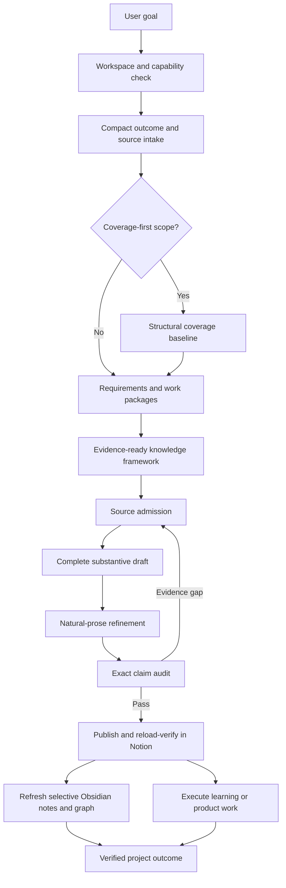

# Architecture

[Documentation](README.md) | [Project README](../README.md)

GDKP separates orchestration, evidence, publication, learning views, and execution so each type of information has one clear home.

## Design Principles

- **Goal-driven:** work begins with an observable result and explicit acceptance conditions.
- **Coverage-aware:** broad knowledge maps are checked against approved structural sources instead of relying on model-memory enumeration.
- **Evidence-gated:** factual sources are registered, audited, and matched to exact publication claims.
- **Reader-facing:** Notion contains finished publications rather than workflow operations.
- **Selective:** Obsidian contains useful concept notes and a sparse graph rather than a second copy of the publication.
- **Recoverable:** local revisions, hashes, handoffs, and checkpoints support reliable resume.
- **Outcome-oriented:** completion requires evidence of learning or a working deliverable.

## The Five Surfaces

| Surface | Responsibility | Must not become |
|---|---|---|
| **Codex** | Control plane, routing, user decisions, and completion reporting | Long-lived machine state or the canonical publication |
| **Zotero** | Source registry, structural coverage baseline, evidence admission, and claim audit | Draft prose or project task management |
| **Notion** | Canonical reader-facing textbook, monograph, report, or requested product document | Questions, task queues, audits, receipts, or workflow chatter |
| **Obsidian** | Selective study notes and a sparse semantic graph derived from verified publications | A mirror of the complete Notion hierarchy |
| **Local project** | Machine state, installed skills, executable work, outputs, and recovery data | Credential storage or unrelated user content |

The default Zotero structure is one root-level `GDKP-<Project Name>` collection with no automatic subcollections. Notion uses one natural publication root under a user-approved parent.

## End-to-End Flow

`knowledge-product-orchestrator` is the only control plane. Every other skill owns one bounded responsibility and returns a validated handoff instead of modifying another skill's artifacts.

## Coverage-First Workflows

Textbooks, curricula, comprehensive surveys, field-level maps, and similarly broad goals use an additional coverage-first branch:

1. Approved structural sources establish what belongs in the field boundary.
2. Coverage breadth and per-topic learning depth are recorded independently.
3. A `TopicCoverageMatrix` maps baseline topics to the planned framework.
4. Every narrowing, deferral, or exclusion is recorded in an `OmissionLedger` with accountable authority.
5. A deterministic coverage audit must pass before the framework is treated as complete.
6. The verified global framework is frozen before large-scale authoring begins.
7. Completion requires every included publication target to be verified or explicitly reclassified through the governed omission process.

Structural sources establish the outline boundary. They do not automatically support the factual claims inside chapters; factual evidence still passes through source admission and exact claim audit.

## Project State and Outputs

| Path | Purpose | Version-control guidance |
|---|---|---|
| `.agents/` | Project-scoped GDKP skills and shared runtime resources | Version the approved core snapshot and reviewed project skills |
| `.knowledge-product/` | Bindings, checkpoints, hashes, receipts, and internal machine artifacts | Keep local by default; never publish credentials or machine-specific bindings |
| `Obsidian/` | Project-local Vault with selective concept notes and native graph settings | Decide per project and preserve user-authored notes |
| `outputs/` | Requested files, software, reports, exercises, or other deliverables | Decide per project and data-sensitivity policy |

Machine YAML, JSON, hashes, handoffs, and audit receipts stay out of routine user review. Users review the actual publication, knowledge view, product output, and verified acceptance result.
